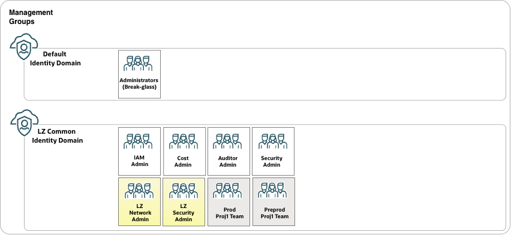
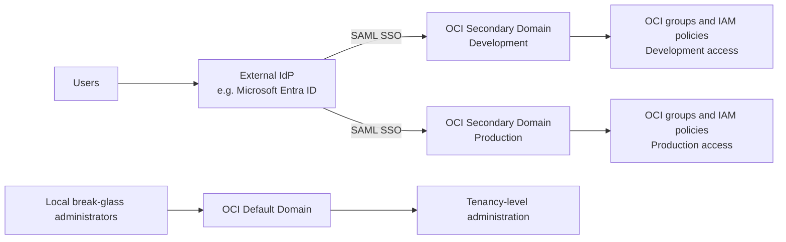

# **[OCI Identity Domains](#)**
## **An OCI Open LZ [Addon](#) for Identity Domain Design**

&nbsp;

**Table of Contents**

- [1. Overview](#1-overview)<br>
- [2. Blueprint Mapping](#2-blueprint-mapping)<br>
- [3. Domain Design](#3-domain-design)<br>
  - [3.1. Common Domain](#31-common-domain)<br>
  - [3.2. Environment Domains](#32-environment-domains)<br>
  - [3.3. Region Domains](#33-region-domains)<br>
  - [3.4. Operating Entities Domains](#34-operating-entities-domains)<br>
- [4. Domain Federation](#4-domain-federation)<br>
  - [4.1. Federation Overview](#41-federation-overview)<br>
  - [4.2. Default Domain](#42-default-domain)<br>
  - [4.3. Secondary Domain Federation](#43-secondary-domain-federation)<br>
- [5. Fusion SaaS Domains](#5-fusion-saas-domains)<br>
  - [5.1. Fusion SaaS Overview](#41-fusion-saas-overview)<br>
  

&nbsp;

## 1. Overview

Welcome to the **OCI Identity Domains** guide.

When designing an OCI tenancy landing zone, it is essential to establish a well-defined IAM (Identity and Access Management) security model from the outset. The IAM design forms the foundation of governance, security, and resource management within the environment. Key considerations include the tenancy structure, identity domains, compartment hierarchy, IAM policies, and access control strategy.
OCI provides built-in resource isolation and governance capabilities through several foundational constructs:

- **Tenancy**: The highest-level security and administrative boundary that contains all OCI resources.
- **Identity Domains**: Logical containers for users, groups, applications, and identity-related configurations, providing authentication and authorization boundaries.
- **Compartments**: Logical partitions used to organize resources, delegate administration, and enforce access controls.
- **IAM Policies**: Policy statements that define who can access which resources and what actions they can perform.

A well-designed tenancy landing zone should include the design of these constructs.
In this add-on, we will focus specifically on the design of the **Identity Domains**

&nbsp;
## 2. Blueprint Mapping

|Identity Domain Pattern|One-OE|Multi-OE|
|---|---|---|
|[Common Domain](#31-common-domain)|Included|Included|
|[Environment Domains](#32-environment-domains)|Optional|Optional|
|[Region Domains](#33-region-domains)|Optional|Optional|
|[Operating Entity Domains](#34-operating-entities-domains)|N/A|Optional|

&nbsp;
## 3. Domain Design

When a tenancy is first created only the **Default** Identity Domain will be available.
Following best practice, the **Default** Identity Domain should be reserved exclusively for break-glass accounts used for emergency access. All other users, groups, and access management functions should be managed within separate Identity Domains.

Some of the IAM best practices related to Identity Domains can be found in the [guide](https://docs.oracle.com/en/solutions/oci-best-practices/manage-identities-and-authorization.html#GUID-3A1634E1-5A72-4650-A227-5F2D1BED5382)

Separating identity domains provides the following key benefits when implementing: 
- Isolation: Users in one identity domain do not impact the work of users in another identity domain. This helps maintain the separation between different environments and ensures that changes made in one domain do not affect the others.
- Administrative Control: Multiple identity domains allow for the isolation of administrative control over each domain. This means that different administrators can have control over different environments, such as development, testing, and production.
- Security Compliance: Implementing separate identity domains helps meet security standards and industry regulations that require the separation of users between different environments. This prevents unauthorized access from development to production and helps maintain a secure environment.

The Domain design and number of Identity Domains in a tenancy is a security design decision which will vary based on individual requirements.
This guide will cover some of the options available.

- In both the One-OE and Multi-OE design the [Common Domain](#31-common-domain) design pattern is included by default.
The decision on whether to keep all the Users and Groups in the Common domain or divide it further will be primarily based on how the operation of the resources need to be managed.
- Where there is a requirement to clearly divide the users accessing Production and Non-Production resources. If this is the case then [Environment Domains](#32-environment-domains) design pattern can be followed
- Every tenancy has a Home region, for example Frankfurt, the tenancy can be subscribed to additional OCI regions as required. If there is a requirement to restrict the users and groups to specific regions then the [Region Domains](#33-region-domains) design pattern can be used.
- In the Multi-OE Blueprint the tenancy can be separated into different Operating Entities in based on the organizational requirements. Further segregation of the Operating Entities can be achieved by also creating a separate domain for each OE following the [Operating Entity Domains](#34-operating-entities-domains) design pattern.

&nbsp;

### 3.1. Common Domain

In this design a single dedicated Common Identity Domain is created to host shared groups and related identity management resources.
Both the One-OE and Multi-OE landing zone blueprints have this as the default Identity Domain design.

<p align="center">
  
</p>

#### IAM Domain Syntax for Common Domain
```text
"identity_domains_configuration": {
    "default_compartment_id"                               : null,
    "default_defined_tags"                                 : null,
    "default_freeform_tags"                                : null,

    "identity_domains": {
        "COMMON-DOMAIN": {
            "display_name"                                 : "id_lz_common",
            "description"                                  : "One-OE LZ common Identity Domain",
            "compartment_id"                               : null,
            "admin_email"                                  : null,
            "admin_first_name"                             : null,
            "admin_last_name"                              : null,
            "admin_user_name"                              : null,
            "allow_signing_cert_public_access"             : false,
            "home_region"                                  : null,
            "is_hidden_on_login"                           : false,
            "is_notification_bypassed"                     : false,
            "is_primary_email_required"                    : false,
            "license_type"                                 : "free",
            "replica_region"                               : null
        }
    }
}
```

The One-OE file: - [oneoe_iam.json](../../blueprints/one-oe/runtime/one-stack/oneoe_iam.json)

&nbsp;

### 3.2. Environment Domains

In this design pattern there is a separate Identity Domain for each environment, for example:
- Production
- Pre-Production
- Test
- Development

The purpose of this is to provide separation of the users and groups who can access the resources in each environment. For example, a user existing only in the Pre-Production domain would not be able to access any resources in the Production domain.

#### IAM Domain Syntax for Environment Domain
```text
"identity_domains_configuration": {
    "default_compartment_id"                               : null,
    "default_defined_tags"                                 : null,
    "default_freeform_tags"                                : null,

    "identity_domains": {
        "PROD-DOMAIN": {
            "display_name"                                 : "id_lz_prod",
            "description"                                  : "One-OE LZ Production Identity Domain",
            "compartment_id"                               : null,
            "admin_email"                                  : null,
            "admin_first_name"                             : null,
            "admin_last_name"                              : null,
            "admin_user_name"                              : null,
            "allow_signing_cert_public_access"             : false,
            "home_region"                                  : null,
            "is_hidden_on_login"                           : false,
            "is_notification_bypassed"                     : false,
            "is_primary_email_required"                    : false,
            "license_type"                                 : "free",
            "replica_region"                               : null
        }
    }
}
```
&nbsp;

### 3.3. Region Domains

In this design pattern there is a separate Identity Domain for each region, for example:
- EU (Frankfurt)
- UK (London)
- US (Ashburn)

The purpose of this is to provide separation of the users and groups who can access the resources in each region. For example, a user existing only in the EU domain would not be able to access any resources in the UK or US domains.
Note that only the Default Identity Domain is automatically replicated from the Home region to all the subscribed regions. When creating additional domains which are required outside the Home region they have to be explicitly synchronized/replicated to that region.

#### IAM Domain Syntax for Environment Domain
```text
"identity_domains_configuration": {
    "default_compartment_id"                               : null,
    "default_defined_tags"                                 : null,
    "default_freeform_tags"                                : null,

    "identity_domains": {
        "UK-DOMAIN": {
            "display_name"                                 : "id_lz_uk",
            "description"                                  : "One-OE LZ UK Region Identity Domain",
            "compartment_id"                               : null,
            "admin_email"                                  : null,
            "admin_first_name"                             : null,
            "admin_last_name"                              : null,
            "admin_user_name"                              : null,
            "allow_signing_cert_public_access"             : false,
            "home_region"                                  : null,
            "is_hidden_on_login"                           : false,
            "is_notification_bypassed"                     : false,
            "is_primary_email_required"                    : false,
            "license_type"                                 : "free",
            "replica_region"                               : "uk-london-1"
        }
    }
}
```
> [!NOTE]
> The Domain synchronization from the home region to the subscribed region is specified in above configuration with the "replica_region"
>
&nbsp;

### 3.4. Operating Entities Domains

An Operating Entity is how a company can segregate it’s resources into organization units. For example:
- LoBs
- OpCos
- Departments
- Products
- Brands
- Partners

The Multi-OE blueprint allows this segregation within a single tenancy using the compartment design.
However, it could also be a requirement for further separation of the resources through use of an Identity Domain for each Operating Entity.

```text
"identity_domains_configuration": {
    "default_compartment_id"                               : null,
    "default_defined_tags"                                 : null,
    "default_freeform_tags"                                : null,

    "identity_domains": {
        "OE01-DOMAIN": {
            "display_name"                                 : "id_lz_oe01",
            "description"                                  : "Multi-OE LZ OE01 Identity Domain",
            "compartment_id"                               : null,
            "admin_email"                                  : null,
            "admin_first_name"                             : null,
            "admin_last_name"                              : null,
            "admin_user_name"                              : null,
            "allow_signing_cert_public_access"             : false,
            "home_region"                                  : null,
            "is_hidden_on_login"                           : false,
            "is_notification_bypassed"                     : false,
            "is_primary_email_required"                    : false,
            "license_type"                                 : "free",
            "replica_region"                               : null
        }
    }
}
```
&nbsp;
## 4. Domain Federation

### 4.1. Federation Overview

Federation allows users to sign in to OCI using their existing corporate identity, managed by an external SAML 2.0 compatible identity provider (IdP), such as Microsoft Entra ID.

The external IdP authenticates the user and returns a signed assertion to the OCI IAM Identity Domain. OCI validates that assertion and establishes the user’s OCI session. The identity domain acts as the service provider in this flow. [Oracle: Managing Identity Providers](https://docs.oracle.com/en-us/iaas/Content/Identity/identityproviders/manage-identity-providers.htm)

OCI IAM remains responsible for authorization: users are placed into OCI groups and OCI IAM policies grant the permissions to OCI resources. Oracle describes federation as managing users and groups in the external IdP while managing authorization in OCI IAM. [Oracle: Overview of IAM](https://docs.oracle.com/en-us/iaas/Content/Identity/getstarted/identity-domains.htm)

### 4.2. Default Domain

The OCI default identity domain should be retained for a small number of local tenancy-administration and break-glass accounts.

For a break-glass design, do not use federation as the only authentication route to the default domain. Keep local, named emergency administrator accounts so tenancy administration remains available if the external IdP, SAML configuration, certificates, or corporate authentication service is unavailable.

It is recommended to use the default identity domain for tenancy-level administration, and using secondary identity domains for the domain designs as described in the sections above.

For a break-glass design, do not use federation as the only authentication route to the default domain. Keep local, named emergency administrator accounts so tenancy administration remains available if the external IdP, SAML configuration, certificates, or corporate authentication service is unavailable.
Break-glass accounts should:
- Be local OCI accounts, individually assigned and never shared.
- Use strong MFA and securely controlled recovery information.
- Be restricted to emergency tenancy administration.
- Be reviewed and tested periodically.

This is an architectural safeguard, not an OCI restriction.

### 4.3. Secondary Domain Federation

Use the OCI secondary identity domains for normal user access. They can separate the user populations as per the Domain designs
- Common Domain
- Environment Domains
- Region Domains
- Operating Entity Domains

The identity domains represent separate user populations. The structure is discussed in further detail here:
[Oracle: IAM Security Structure](https://docs.oracle.com/en-us/iaas/Content/cloud-adoption-framework/iam-security-structure.htm)



> [!NOTE]
> Each secondary domain is configured independently with the external IdP.

### 4.4. IAM Groups Federation

When the IAM Domain is federated the IdP will master the IAM Groups. These will be synchronised to OCI, typically through SCIM.
In this scenarion the IAM Groups should be removed from the LZ IAM JSON configuration to be created by the IdP.

Consideration should be given to the naming convention of the IAM Groups in the IdP.
For simplicity it is generally recommended to keep the IdP and IAM Groups naming convention the same. However it is possible to use different naming together with mapping. In this case care must be taken in the administration of the groups and mappings.

The IAM Group Names must be reflected in the IAM Policies and the policy statements may need to be updated to match the updated IAM Group Names mastered in the IdP.
Also note that the IAM Policies will need to be compiled after the IAM Groups have been created.

The default IAM Group Names for One-OE are shown below:

| Group Name | Draw.io Name | Description |
|---|---|---|
| `grp-auditors-admin` | Auditors Admin | Tenancy-scoped audit and read-only access group. |
| `grp-cost-admin` | Cost Admin | Tenancy-scoped cost management access group. |
| `grp-iam-admin` | IAM Admin | Tenancy-scoped IAM administration access group. |
| `grp-security-admin` | Security Admin | Tenancy-scoped security service administration access group. |
| `grp-lz-network-admin` | LZ Network Admin | Landing Zone shared network administration access group. |
| `grp-lz-preprod-proj1-admin` | LZ Preprod Proj1 Admin | Landing Zone Pre-Production environment, Project 1 administration access group. |
| `grp-lz-prod-proj1-admin` | LZ Prod Proj1 Admin | Landing Zone Production environment, Project 1 administration access group. |
| `grp-lz-security-admin` | LZ Security Admin | Landing Zone shared security administration access group. |

### 4.5. Federation Steps

1. The LZ will create the IAM Domain which will be federated, for example the **Common** domain.
2. The Common IAM domain will be manually federated with the externall IdP [Federating with Identity Providers](https://docs.oracle.com/en-us/iaas/Content/Identity/federating/federating_section.htm)
3. The IAM Groups are created in the IdP and synchronised to IAM
4. The IAM policy statements are verified with the IAM Group names and compiled

&nbsp;
## 5. Fusion SaaS Domains

### 5.1. Fusion SaaS Overview
In a tenancy where Fusion SaaS applications will be deployed often the activation of the SaaS environments is the first deployment to the tenancy.

If Fusion SaaS activation creates the new OCI tenancy, and the person entered as the first administrator is created in the tenancy’s Default identity domain with OCI **Administrator** group.

This OCI Default domain administrator is distinct from normal Fusion application users. Fusion environments use their own Fusion Applications identity domain for application users and roles

Within the Landing Zone the Fusion Applications Administrator by default should be and IAM Group in the Common Domain with the policies as defined here: [Fusion Applications Environment Administrator](https://docs.oracle.com/en-us/iaas/Content/fusion-applications/fa-add-apps-users.htm#fa-roles)

### 5.2. Fusion SaaS Domain

Oracle automatically creates an OCI IAM identity domain per Fusion Applications environment.

It has the domain type **Oracle Apps**, and the displayed name/system URL is Oracle generated often including an opaque identifier.
It is often not really possible to infer the environment ownership from the IAM  name.

The Fusion environment and it's associated domain can be viewed in the OCI Console Menu:
OCI Console → My Applications → Fusion Applications → select environment → Associated identity domain

### 5.2. Fusion SaaS Domains and OCI Domains

In many cases the Fusion SaaS environment domains and OCI Secondary domains will be maintained separate user populations as the functions are usually different.
For example: A Fusion SaaS Production environment will contain all the users who have access to login and use the Fusion application whilst the OCI Production domain is for the user population who have access to create, modify and view the OCI PaaS and IaaS services.

In some cases the number of Fusion SaaS environment domains may not be 1:1 with the OCI domains.
For example Fusion can have 3 environments Production, Test, Development but the OCI only has the Common domain. 

For certain OCI services, like OIC, in a PaaS4SaaS tenancy the users may be in the Fusion SaaS domain
https://docs.oracle.com/en/cloud/saas/applications-common/26c/oaext/provision-a-new-platform-as-a-service-into-a-fusion-identity-and-access-management-domain-.html


&nbsp;

#### License

Copyright (c) 2026 Oracle and/or its affiliates.

Licensed under the Universal Permissive License (UPL), Version 1.0.

See [LICENSE](../../LICENSE.txt) for more details.
