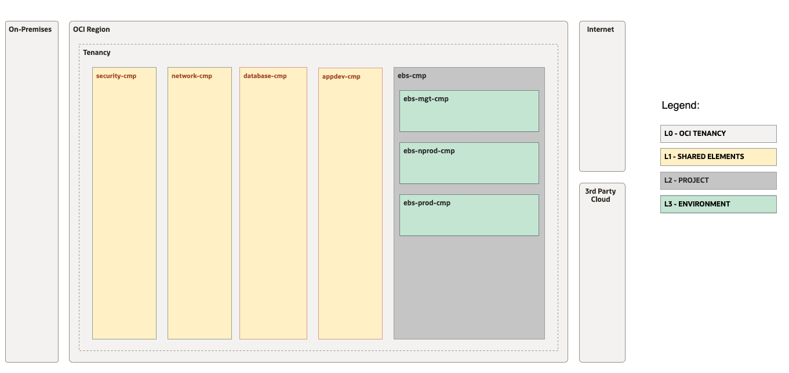
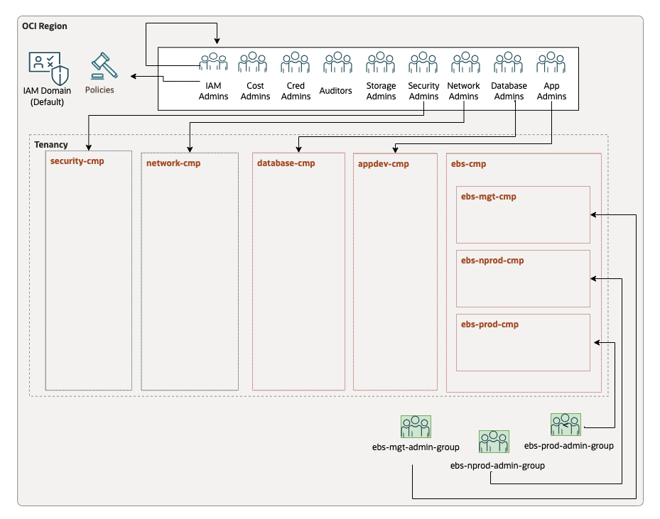
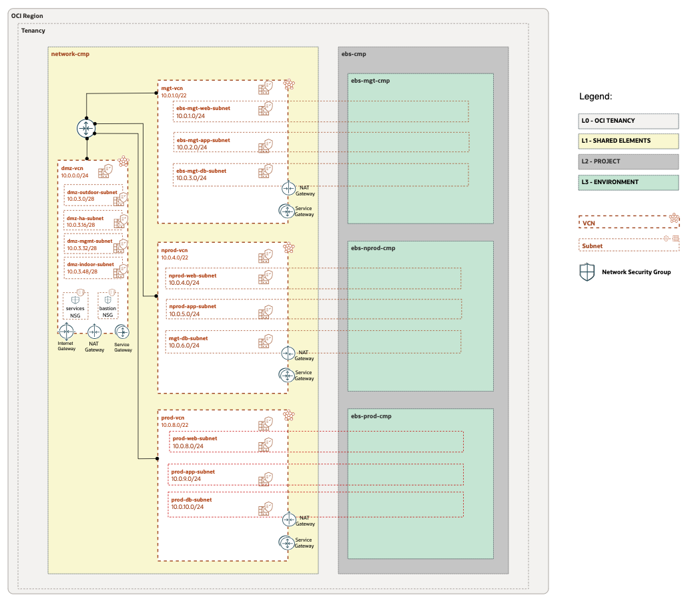

# **[EBS Landing Zone Extension](#)**
## **An OCI Open LZ [Workload Extensions](#) to Reduce Your Time-to-Production**
 

&nbsp; 

**Table of Contents**

[1. Introduction](#1-introduction) 
[2. Design Decisions](#2-design-overview) 
[3. Security View](#3-security-view) 
[4. Network View](#4-network-view) 
[5. Runtime View](#5-runtime-view) 

&nbsp; 

## **1. Introduction**

Welcome to the **OCI EBS Landing Zone Extension**.

The EBS LZ Extension is a secure cloud environment, designed with best practices to simplify the onboarding of EBS workloads and enable the continuous operations of their cloud resources. This reference architecture provides a landing zone IaC **configuration** that meets the security guidance prescribed in the CIS Oracle Cloud Infrastructure Foundations Benchmark.

It's highly recommended to deploy this Landing Zone before migrating an on-premises Oracle EBS to OCI, as it sets a complete OCI foundation for its workloads. 

&nbsp; 

## **2. Design Overview**

|ID   |	DOMAIN | DESCRIPTION |
|---|---|---|
| **1** | **General** | - OCI CIS LZ will be deployed as a foundation.  - The EBS LZ Extension will extend the OCI CIS LZ and accomodate EBS Workloads. </li> </ul> |
|**2** | **Tenancy Structure** |  Extend the standard landing zone compartment structure with additional compartments for EBS-related resources:  - Parent EBS compartment. - EBS Management compartment for resources such as EBS Cloud Manager. - EBS Non-Production environments compartment  - EBS Production environment compartment.
|**3** | **Groups & Policies** | Additional groups and associated policies are deployed to manage EBS compartment resources. |
|**4** | **Network Structure** | Additional VCNs and related elements will be added - to segregate EBS environments - as Spoke extensions to the OCI CIS LZ Hub. |
|**5** |  **Runtime** | - There will be **three runtime operations** to deploy this landing zone: **(1)** The OCI CIS LZ will be used as an initial setup and **(2)** extended with the EBS LZ Extension Runtime configurations. Additional **(3)** manual configuration tasks are also required to complete the setup.   - Note that the **'Operation/(OP)**' column on the next sections identifies the three moment in time when OCI resources are created.  - For more details refer to the [Runtime](#5-runtime-view) section.

&nbsp; 

## **3. Security View**

&nbsp; 

### **3.1 Compartments**

The EBS LZ Extension  includes the following compartments:
&nbsp; 
> [!NOTE]
> Compartments help you organize and control access to your resources. A compartment is a collection of related resources (such as cloud networks, compute instances, or block volumes) that can be accessed only by those groups that have been given permission by an administrator in your organization.

&nbsp;

&nbsp; 

The following table provides details on the compartments presented above, their level of deepness in the tenancy, and objectives. 

&nbsp; 

|ID   |	OP	 | LEVEL	 |	NAME	 | OBJECTIVES |
|---|---|---|---|---| 
|CMP.00   |	OP. ID.01	 |0	 |	( root) Tenancy		 | Holds tenancy global resources	 |
|CMP.01		 | OP. ID.01		 |	1		 |security-cmp		 |Support shared central resources associated with security	 |
|CMP.02		 | OP. ID.01	 |1		 |network-cmp		 | Support shared central resources associated with network	 |
|CMP.03		 | OP. ID.01 |	1	 |	database-cmp		 |Support database workload resources ( can be removed if not needed)	 |
|CMP.04	 |	OP. ID.01|	1	 |	appdev-cmp		 |Support appdev workload resources ( can be removed if not needed)	 |
|CMP.05	 |	OP. ID.02	 |	1	 |	ebs-cmp		 |Parent EBS compartment 	 |
|CMP.06	 | OP. ID.02	| 2 	 |ebs-mgt-cmp		 |EBS Management compartment for resources such as EBS Cloud Manager	 |
|CMP.07	 |	OP. ID.02		 |2		 |ebs-nprod-cmp	 |	EBS Non-Production environments compartment	 |
|CMP.08	 |	OP. ID.02		 |2		 |ebs-prod-cmp		 |EBS Production environment compartment	 |

&nbsp; 

### **3.2 Groups**

The EBS LZ Extension  includes the following groups. 

&nbsp; 

> [!NOTE]
> In OCI Identity and Access Management, groups are the links between user accounts and applications.

&nbsp; 

&nbsp; 

|ID   |	OP	 | NAME	| OBJECTIVES |
|---|---|---|---| 
|GRP.01|	OP#01|	cost-admin-group	|OCI CIS LZ group for Cost management|
|GRP.02|	OP#01|	security-admin-group|	OCI CIS LZ group for security services management|
|GRP.03|	OP#01|	auditor-group	|OCI CIS LZ group for auditing the tenancy|
|GRP.04|	OP#01|	network-admin-group	|OCI CIS LZ group for managing networks|
|GRP.05|	OP#01|	database-admin-group	|OCI CIS LZ group for managing databases|
|GRP.06|	OP#01|	appdev-admin-group	|OCI CIS LZ group for managing app development related services|
|GRP.07|	OP#01|	storage-admin-group	|OCI CIS LZ group for storage services management|
|GRP.08|	OP#01|	cred-admin-group	|OCI CIS LZ group for managing users credentials in the tenancy|
|GRP.09|	OP#01|	announcement-reader-group	|OCI CIS LZ group for reading Console announcements|
|GRP.10|	OP#01|	iam-admin-group|	OCI CIS LZ group for managing IAM resources in the tenancy|
|GRP.11|	OP#02|	ebs-mgt-admin-group	|EBS Management admin group for resources in the EBS Management compartment|
|GRP.12|OP#02|ebs-nprod-admin-group	|EBS Non-Production admin group for resources in the EBS Non-Production compartment|
|GRP.13|	OP#02|	ebs-prod-admin-group|	EBS Production admin group for resources in the EBS Production compartment|

&nbsp; 

### **3.3 Dynamic Groups**

The OCI  EBS LZ  includes the following dynamic groups:

&nbsp; 

> [!NOTE]
> Dynamic groups allow you to group Oracle Cloud Infrastructure compute instances as "principal" actors (similar to user groups). You can then create policies to permit instances to make API calls against Oracle Cloud Infrastructure services

&nbsp; 

|ID   |	OP	 | NAME	| OBJECTIVES |
|---|---|---|---| 
|DG.01|	OP#01|	database-kms-dynamic-group	|OCI CIS LZ dynamic group for databases accessing Key Management service (aka Vault service).|
|DG.02|	OP#01|	appdev-computeagent-dynamic-group|	OCI CIS LZ dynamic group for Compute Agent plugin execution.|
|DG.03|	OP#01|	appdev-fun-dynamic-group	|OCI CIS LZ dynamic group for application functions execution.	|
|DG.04|	OP#01|	sec-fun-dynamic-group	|OCI CIS LZ dynamic group for security functions execution.|

&nbsp; 

### **3.4 Policies**

The EBS LZ Extension includes the following policies:

&nbsp; 

> [!NOTE]
> A Policy is a document that specifies who can access which Oracle Cloud Infrastructure resources that your company has, and how. A policy simply allows a group to work in certain ways with specific types of resources in a particular compartment

&nbsp; 

|ID   |	OP	 |  NAME	| OBJECTIVES |
|---|---|---|---| 
|POL.01|	OP#01|	iam-admin-root-policy	|OCI CIS LZ root compartment policy for ebslz1-iam-admin-group group|
|POL.02	|OP#01	|auditor-policy	|OCI CIS LZ root compartment policy for ebslz1-auditor-group group|
|POL.03	|OP#01	|cost-admin-root-policy	|OCI CIS LZ root compartment policy for ebslz1-cost-admin-group group|
|POL.04	|OP#01	|credential-admin-policy	|OCI CIS LZ root compartment policy for ebslz1-cred-admin-group group|
|POL.05	|OP#01	|basic-root-policy	|OCI CIS LZ basic root compartment policy|
|POL.06	|OP#01	|announcement-reader-policy	|OCI CIS LZ root compartment policy for announcement-reader-group group|
|POL.07	|OP#01	|security-admin-root-policy	|OCI CIS LZ root compartment policy for security-admin-group group|
|POL.08	|OP#01	|services-policy	|OCI CIS LZ policy for OCI services|
|POL.09	|OP#02	|ebs-root-admin-policy	|EBS root policies|
|POL.10 |OP#02|ebs-security-admin-policy	|EBS security-related policies|
|POL.11	|OP#02|	ebs-network-admin-policy|	EBS network-related policies|
|POL.12	|OP#02	|ebs-mgt-admin-policy|	EBS policies for EBS Management compartment|
|POL.13	|OP#02	|ebs-nprod-admin-policy|	EBS policies for EBS Non-Production compartment|
|POL.14	|OP#02	|ebs-prod-admin-policy|	EBS policies for EBS Production compartment|

&nbsp; 
&nbsp; 

## **4. Network View**
&nbsp; 

The following diagram presents the network structure of the EBS LZ Extension.

&nbsp; 

&nbsp; 

### **4.1 VCNs**

The following table describes the proposed VCNs.

&nbsp; 

> [!NOTE]
> A VCN is a customizable, software-defined network that you set up in an Oracle Cloud Infrastructure region. Like traditional data center networks, VCNs give you complete control over your network environment. A VCN can have multiple non-overlapping CIDR blocks that you can change after you create the VCN.
&nbsp; 

|ID   |	OP	 | NAME	| OBJECTIVES |
|---|---|---|---| 
|VCN.01|	OP#01|	dmz-vcn	| CIS OCI Landing Zone Hub VCN. |
|VCN.02	|OP#02	|ebs-mgt-vcn	| Spoke VCN for EBS Cloud Manager. |
|VCN.03	|OP#02|	ebs-nprod-vcn	| Spoke VCN for EBS Non-Production Environment. |
|VCN.04	|OP#02|	ebs-prod-vcn	| Spoke VCN for EBS Production Environment. N|

&nbsp; 

### **4.2 Subnets**

The following table describes the proposed Subnets.

&nbsp; 

> [!NOTE]
> You can segment a VCN into subnets, which can be scoped to a region or to an availability domain. Each subnet consists of a contiguous range of addresses that don't overlap with the other subnets in the VCN. You can change the size of a subnet after creation. A subnet can be public or private.
> 
&nbsp; 

|ID   |	OP	 |  NAME	| OBJECTIVES |
|---|---|---|---| 
|SN.01|	OP#01|	dmz-outdoor-subnet	| OCI CIS LZ Hub public Subnet. |
|SN.02|	OP#01|	dmz-ha-subnet	| OCI CIS LZ Hub private Subnet. |
|SN.03	|OP#01	|dmz-mgmt-subnet	|OCI CIS LZ Hub public Subnet. |
|SN.04|	OP#01|	dmz-indoor-subnet	|OCI CIS LZ Hub private Subnet- |
|SN.05	|OP#02|	ebs-mgt-web-subnet	|  EBS Management Load Balancer Subnet. |
|SN.06	|OP#02	|ebs-mgt-app-subnet	|EBS Management Application Tier Subnet. |
|SN.07|	OP#02	|ebs-mgt-db-subnet	| EBS Management Database Tier Subnet. |
|SN.08|	OP#02	|ebs-nprod-web-subnet	| EBS Non-Production Load Balancer Subnet. |
|SN.09	|OP#02	|ebs-nprod-app-subnet	| EBS Non-Production Application Tier Subnet. |
|SN.10	|OP#02|	ebs-nprod-db-subnet	| EBS Non-Production Database Tier Subnet. |
|SN.11	|OP#02|	ebs-prod-web-subnet	| EBS Production Load Balancer Subnet|
|SN.12|	OP#02	|ebs-prod-app-subnet	| EBS Production Application Tier Subnet|
|SN.13|	OP#02	|ebs-prod-db-subnet	| EBS Production Database Tier Subnet|

&nbsp; 

### **4.3 Network Security Groups (NSGs)**

The following table describes the proposed NSGs.

&nbsp; 

> [!NOTE]
> A network security group (NSG) provides a virtual firewall for a set of cloud resources that all have the same security posture. For example: a group of compute instances that all perform the same tasks and thus all need to use the same set of ports.

&nbsp; 

|ID   |	OP	 |  NAME	| OBJECTIVES |
|---|---|---|---| 
|NSG.01|	OP#01|	dmz-vcn-bastion-nsg	|OCI CIS LZ Hub bastion NSG|
|NSG.02	|OP#01|	dmz-vcn-services-nsg|	OCI CIS LZ Hub service NSG|

&nbsp; 

### **4.4 Route Tables (RTs)**

The following table describes the proposed Route Tables.

&nbsp; 

> [!NOTE]
> A collection of RouteRule objects, which are used to route packets based on destination IP to a particular network entity.

&nbsp; 
 
|ID   |	OP	 |  NAME	| OBJECTIVES |
|---|---|---|---| 
|RT.01	|OP#01	|dmz-mgmt-subnet-rtable	|OCI CIS LZ Hub Subnet Route Table|
|RT.02	|OP#01	|dmz-indoor-subnet-rtable	|OCI CIS LZ Hub Subnet Route Table|
|RT.03	|OP#01	|dmz-ha-subnet-rtable	|OCI CIS LZ Hub Subnet Route Table|
|RT.04	|OP#01	|dmz-outdoor-subnet-rtable	|OCI CIS LZ Hub Subnet Route Table|
|RT.05	|OP#02	|mgt-web-subnet-rtable	| EBS Management Load Balancer Subnet Route Table.|
|RT.06	|OP#02	|mgt-app-subnet-rtable	| EBS Management Application Tier Subnet Route Table.|
|RT.07	|OP#02	|mgt-db-subnet-rtable	| EBS Management Database Tier Subnet Route Table.|
|RT.08	|OP#02	|nprod-web-subnet-rtable	| EBS Non-Production Load Balancer Subnet Route Table.|
|RT.09	|OP#02	|nprod-app-subnet-rtable	| EBS Non-Production Application Tier Subnet Route Table.|
|RT.10	|OP#02	|nprod-db-subnet-rtable	| EBS Non-Production Database Tier Subnet Route Table.|
|RT.11	|OP#02	|prod-web-subnet-rtable	| EBS Production Load Balancer Subnet Route Table.|
|RT.12	|OP#02	|prod-app-subnet-rtable	| EBS Production Application Tier Subnet Route Table|
|RT.13	|OP#02	|prod-db-subnet-rtable	| EBS Production Database Tier Subnet Route Table|

&nbsp; 

### **4.5 Security Lists (SLs)**

The following table describes the proposed Security Lists (SLs).

&nbsp; 

> [!NOTE]
> A security list consists of a set of ingress and egress security rules that apply to all the VNICs in any subnet that the security list is associated with. This means that all the VNICs in a given subnet are subject to the same set of security lists
&nbsp;

|ID   |	OP	 |  NAME	| OBJECTIVES |
|---|---|---|---| 
|SL.01	|OP#01|	dmz-vcn-indoor-subnet-security-list	|OCI CIS LZ Hub Subnet Security List	|
|SL.02	|OP#01|	dmz-vcn-outdoor-subnet-security-list	|OCI CIS LZ Hub Subnet Security List	|
|SL.03	|OP#01|	dmz-vcn-mgmt-subnet-security-list	|OCI CIS LZ Hub Subnet Security List	|
|SL.04	|OP#01|	dmz-vcn-ha-subnet-security-list	|OCI CIS LZ Hub Subnet Security List	|
|SL.05	|OP#02|	mgt-web-subnet-security-list	| EBS Management Load Balancer Subnet Security List	|
|SL.06	|OP#02|	mgt-app-subnet-security-list	| EBS Management Application Tier Subnet Security List	|
|SL.07	|OP#02|	mgt-db-subnet-security-list	| EBS Management Database Tier Subnet Security List	|
|SL.08	|OP#02|	nprod-web-subnet-security-list	| EBS Non-Production Load Balancer Subnet Security List	|
|SL.09	|OP#02|	nprod-app-subnet-security-list	| EBS Non-Production Application Tier Subnet Security List	|
|SL.10	|OP#02|	nprod-db-subnet-security-list	| EBS Non-Production Database Tier Subnet Security List	|
|SL.11	|OP#02|	prod-web-subnet-security-list	| EBS Production Load Balancer Subnet Security List	|
|SL.12	|OP#02|	prod-app-subnet-security-list	| EBS Production Application Tier Subnet Security List	|
|SL.13	|OP#02|	prod-db-subnet-security-list	| EBS Production Database Tier Subnet Security List	|

&nbsp; 

&nbsp; 

### **4.6 Gateways**
&nbsp; 

#### **4.6.1 Dynamic Routing Gateway (DRGs)**
The following tables describe the proposed DRGs and DRG Attachments.

&nbsp; 

> [!NOTE]
> A DRG acts as a virtual router, providing a path for traffic between your on-premises networks and VCNs, and can also be used to route traffic between VCNs. Using different types of attachments, custom network topologies can be constructed using components in different regions and tenancies.

&nbsp;

|ID   |	OP	 |  NAME	| OBJECTIVES |
|---|---|---|---| 
|DRG.01|	OP#01|	drg | DRG deployed by CIS LZ |

&nbsp; 

#### **DRG Attachments**

> [!NOTE]
> A DRG attachment serves as a link between a DRG and a network resource. A DRG can be attached to a VCN, IPSec tunnel, remote peering connection, or virtual circuit. For more information, see Overview of the Networking Service.

&nbsp;

| ID   |	OP	 |  NAME	| OBJECTIVES |
|---|---|---|---| 
|DRGA.01|	OP#01|	dmz-vcn-drg-attachment| DRG Attachment for the OCI CIS LZ Hub VCN.  |
|DRGA.02|	OP#02|	mgt-vcn-drg-attachment| DRG Attachment for EBS management VCN. |
|DRGA.03|	OP#02|	prod-vcn-drg-attachment| DRG Attachment for EBS production VCN. |
|DRGA.04|	OP#02|	nprod-vcn-drg-attachment| DRG Attachment for EBS non-production VCN. |

&nbsp; 

#### **4.6.2 Internet Gateway (IGs)**
The following table describes the proposed Internet Gateways.

&nbsp; 

> [!NOTE]
> Internet Gateway is used to access the internet from a VCN (say, network) in Oracle Cloud Infrastructure. It supports connections initiated from within the VCN (egress) and connections initiated from the internet (ingress)

&nbsp;

| ID   |	OP	 |  NAME	| OBJECTIVES |
|---|---|---|---| 
|IG.01|	OP#01|	dmz-vcn-igw | Internet Gateway in the Hub VCN. |

&nbsp; 

#### **4.6.3 NAT Gateway (NGs)**
The following table describes the proposed NAT Gateways.

&nbsp; 

> [!NOTE]
> NAT gateway gives private subnet access to the Internet without assigning the host a public IP address. It only enables outbound connections to the private subnets like performing patches, updates, or just resources that need general internet connectivity outbound.

&nbsp;

| ID  |	OP	 |  NAME	| OBJECTIVES |
|---|---|---|---| 
|NG.01|	OP#01|	dmz-vcn-natgw | NAT Gateway in the Hub VCN. |

&nbsp; 

#### **4.6.4 Service Gateway (SGs)**
The following table describes the proposed Service Gateways.

&nbsp; 
> [!NOTE]
> A service gateway lets your virtual cloud network (VCN) privately access specific Oracle services without exposing the data to the public internet. No internet gateway or NAT gateway is required to reach those specific services. The resources in the VCN can be in a private subnet and use only private IP addresses.

&nbsp;

|ID   |	OP	 |  NAME	| OBJECTIVES |
|---|---|---|---| 
|SG.01|	OP#01|	dmz-vcn-sgw | SG in the Hub VCN. |
|SG.02|	OP#02|	mgt-vcn-sgw | SG in the EBS management spoke VCN. |
|SG.03|	OP#02|	prod-vcn-sgw | SG in the EBS production spoke VCN. |
|SG.04|	OP#02|	nprod-vcn-sgw | SG in the EBS non-production spoke VCN. |

&nbsp; 

## **5. Runtime View**

&nbsp; 

This chapter presents the EBS LZ Extension operations scenarios.

 The operations scenarios are one of the most important elements of this design, as they represent the use cases and its key activities on the EBS LZ Extension that create or update resources.

An operation scenario is normally triggered by a service request, on a ticketing system. In a more formal definition, it should be seen as an operational process, which is a set of correlated activities executed as one unit of work, with its own frequency. The owner of each scenario will be the cloud operations team which has associated OCI Groups and Policies that allow the management of those resources.

&nbsp; 

The EBS LZ Extension has three operation scenarios described in the following table.

&nbsp; 

| OP. ID | OPERATION SCENARIOS DESCRIPTION | TIME EFFORTS | 
|---|---|---| 
| **[OP. ID.01](/workload-extensions/ebs/op01-deploy-CIS/readme.md)** | **Deploy CIS OCI LZ**. Cover Core network resources ( hub VCN), Core IAM resources (compartments, group, policies), and security services. | **< 1h** | 
| **[OP. ID.02](/workload-extensions/ebs/op02-manage-ebs-lz-extension/readme.md)**| **Deploy EBS extension**. Include EBS network resources (Spokes VCNs, Table Routes, Security Lists) and IAM EBS resources (Groups, Policies). | **< 2h** excluding TF environment configuration | 
| **[OP. ID.03](/workload-extensions/ebs/op03-manual-changes/readme.md)**| **Manual changes**. | **< 15m** | 
 

&nbsp; 

&nbsp; 

# License

Copyright (c) 2025 Oracle and/or its affiliates.

Licensed under the Universal Permissive License (UPL), Version 1.0.

See [LICENSE](/LICENSE.txt) for more details.
