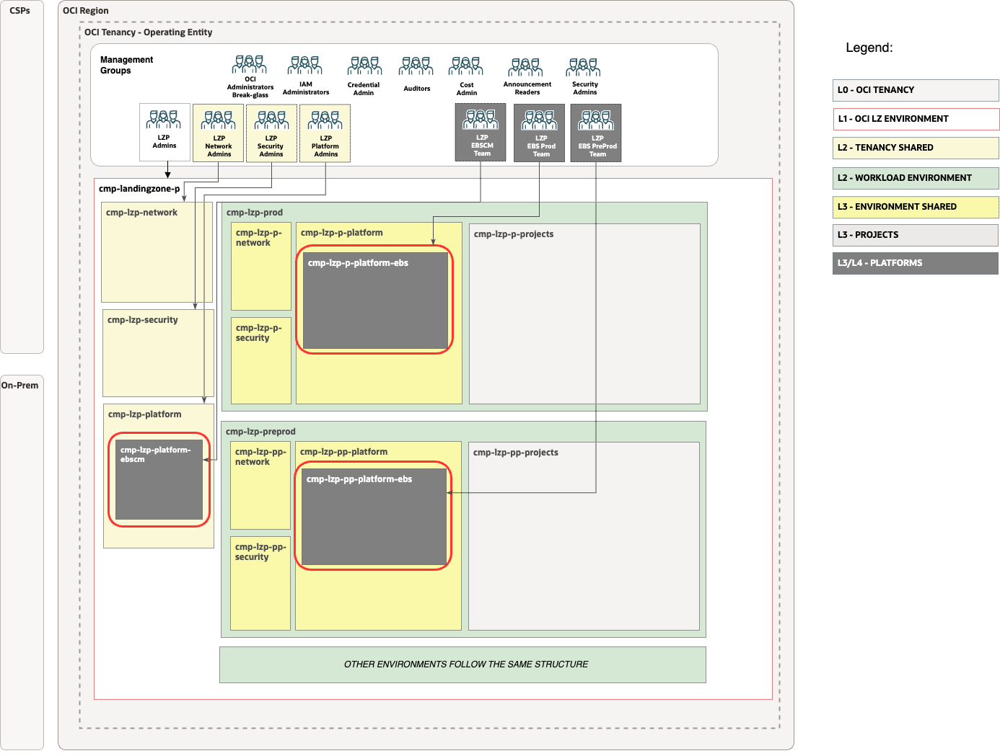
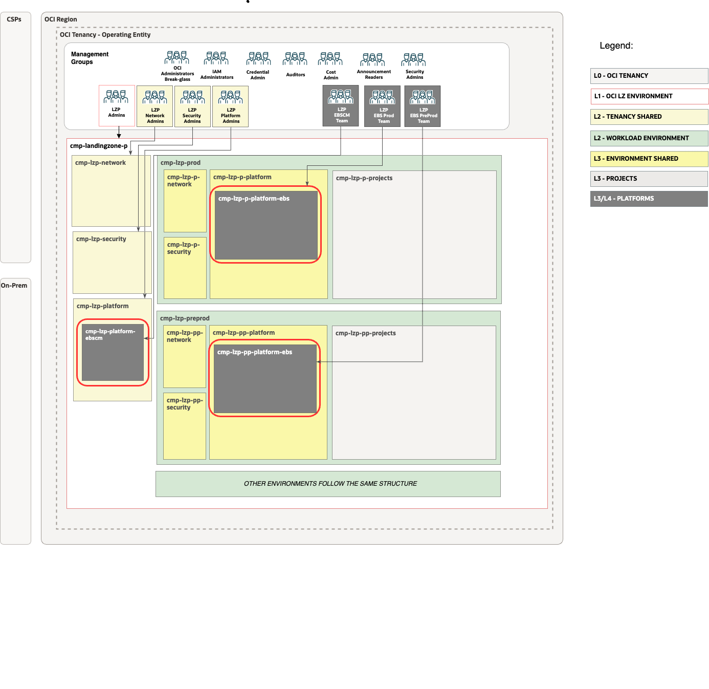

# EBS Landing Zone Extension Set-up <!-- omit from toc -->

## **Table of Contents** <!-- omit from toc -->

- [**1. Summary**](#1-summary)
- [**2. Setup IAM Configuration**](#2-setup-iam-configuration)
  - [**2.1. Compartments**](#21-compartments)
  - [**2.2 Groups**](#22-groups)
  - [**3.4 Dynamic groups**](#34-dynamic-groups)
  - [**2.3 Policies**](#23-policies)
- [**3. Setup Network Configuration**](#3-setup-network-configuration)
  - [**3.1 VCNs**](#31-vcns)
  - [**3.2 Subnets**](#32-subnets)
  - [**3.3 Route Tables (RTs)**](#33-route-tables-rts)
  - [**3.4 Security Lists (SLs)**](#34-security-lists-sls)
  - [**3.5 Gateways**](#35-gateways)
    - [**3.5.1 Dynamic Routing Gateway (DRGs) Attachments**](#351-dynamic-routing-gateway-drgs-attachments)
    - [**3.5.2 Service Gateway**](#352-service-gateway)
- [**4. JSON files Required Changes**](#4-json-files-required-changes)
- [**4. Deploy**](#4-deploy)


## **1. Summary**

|                         |                                                                                                                            |
| ----------------------- | -------------------------------------------------------------------------------------------------------------------------- |
| **NAME**                | EBS Landing Zone Extension set-up                                                                                                    |
| **OBJECTIVE**           | Provision Identity and Network                                                                               |
| **TARGET RESOURCES**    | - **Identity**: Compartments, Groups, Dynamic groups and Policies </br>- **Network**: Spoke VCNs, Route tables, Security Lists, NSGs                 |
| **PREREQUISITES**       | The [One-OE](../../../blueprints/one-oe/) Blueprint deployed as a foundation. </br> For this example we have used: </br> [](https://cloud.oracle.com/resourcemanager/stacks/create?zipUrl=https://github.com/oci-landing-zones/terraform-oci-modules-orchestrator/archive/refs/tags/v2.0.5.zip&zipUrlVariables={"input_config_files_urls":"https://raw.githubusercontent.com/oci-landing-zones/oci-landing-zone-operating-entities/master/blueprints/one-oe/runtime/one-stack/oci_open_lz_one-oe_iam.auto.tfvars.json,https://raw.githubusercontent.com/oci-landing-zones/oci-landing-zone-operating-entities/master/blueprints/one-oe/runtime/one-stack/oci_open_lz_hub_a_network_light.auto.tfvars.json,https://raw.githubusercontent.com/oci-landing-zones/oci-landing-zone-operating-entities/master/blueprints/one-oe/runtime/one-stack/oci_open_lz_one-oe_observability_cisl1.auto.tfvars.json,https://raw.githubusercontent.com/oci-landing-zones/oci-landing-zone-operating-entities/master/blueprints/one-oe/runtime/one-stack/oci_open_lz_one-oe_security_cisl1.auto.tfvars.json"}) </br>**Note**: To understand how to perform this operation with ORM, follow these [steps](ORM_ONE-OE_deployment_steps.md).|
| **CONFIGURATION FILES** | - [oci_ebs_lz_ext_iam.auto.tfvars.json](./oci_ebs_lz_ext_iam.auto.tfvars.json)  </br> - [oci_ebs_lz_ext_network.auto.tfvars.json](./oci_ebs_lz_ext_network.auto.tfvars.json)|
| **DEPLOYMENT**          | [](https://cloud.oracle.com/resourcemanager/stacks/create?zipUrl=https://github.com/oci-landing-zones/terraform-oci-modules-orchestrator/archive/refs/tags/v2.0.5.zip&zipUrlVariables={"input_config_files_urls":"https://raw.githubusercontent.com/oci-landing-zones/oci-landing-zone-operating-entities/refs/heads/EBS/workload-extensions/EBS/1_EBS_extension/EBS_identity.auto.tfvars.json,https://raw.githubusercontent.com/oci-landing-zones/oci-landing-zone-operating-entities/refs/heads/EBS/workload-extensions/EBS/1_EBS_extension/EBS_network.auto.tfvars.json"}) </br> **Note**: To understand how to perform this operation with ORM, follow these [steps](ORM_EBS-LZ-EXT_deployment_steps.md). [Terraform CLI](/commons/content/terraform.md)  can be also used.           |

&nbsp; 

## **2. Setup IAM Configuration**

For configuring and running the One-OE Landing Zone EBS extension IAM Layer use the following JSON file: [oci_ebs_lz_ext_iam.auto.tfvars.json](./oci_ebs_lz_ext_iam.auto.tfvars.json). You can customize this configuration to fit your exact OCI IAM topology.

This configuration file covers three categories of resources described in the next sections.

###  **2.1. Compartments**

The EBS LZ extension provisions three **compartments**: two dedicated to managing environments, such as PROD and PRE-PROD, and a third compartment for EBS Cloud Manager.

New EBS compartments will be added as platform in each One-OE LZ environment, following the example shown in the next diagram:



> [!NOTE]
> For extended documentation regarding compartment definition please refer to the [Identity & Access Management CIS Terraform module compartment example](https://github.com/oracle-quickstart/terraform-oci-cis-landing-zone-iam/blob/main/compartments/examples/vision/input.auto.tfvars.template).


### **2.2 Groups**

The EBS extension will deploy IAM groups to manage resources in EBS compartments and provide fine-grained access to specific EBS resources.

As part of the deployment the following groups are created in the [Default Identity Domain](https://docs.oracle.com/en-us/iaas/Content/Identity/domains/overview.htm):


| ID     |     NAME                       | TYPE | OBJECTIVES                                  |
| ------ |  -------------------------- | ------------------------------------------- |---|
| GRP.00 |  grp-lzp-m-platform-EBS-admins | IAM |Group for managing mgt EBS-related resources |
| GRP.01 | grp-lzp-p-platform-EBS-admins | IAM| Group for managing Prod EBS-related resources |
| GRP.02 |  grp-lznp-pp-platform-EBS-admins | IAM | Group for managing Pre-prod EBS-related resources |
| GRP.03 |  grp-lzp-p-platform-EBS-viewer-role | IAM + EBS RBAC |Group for managing Prod EBS-related resources |
| GRP.04 |  grp-lzp-p-platform-EBS-admin-role | IAM + EBS RBAC |Group for managing Prod EBS-related resources |
| GRP.05 |  grp-lzp-pp-platform-EBS-viewer-role | IAM + EBS RBAC |Group for managing Pre-prod EBS-related resources |
| GRP.06 |  grp-lzp-pp-platform-EBS-admin-role | IAM + EBS RBAC |Group for managing Pre-prod EBS-related resources |


In our pattern we define two different types of groups:

1. **IAM groups** to manage resources in EBS compartments.
2. **IAM groups with EBS RBAC** to grant fine-grained access control to EBS specific resources. In addition to IAM, the Kubernetes RBAC Authorizer can enforce additional fine-grained access controls via Kubernetes RBAC roles and clusterroles. A Kubernetes RBAC role is a collection of permissions. For example, a role might include read permission on pods and list permission for pods. A Kubernetes RBAC clusterrole is just like a role, applies across the whole cluster. A Kubernetes RBAC rolebinding maps a role to a user or group, granting that role's permissions to the user or group for resources in a namespace. Similarly, a Kubernetes RBAC clusterrolebinding maps a clusterrole to a user or group, granting that clusterrole's permissions across the entire cluster. IAM and the Kubernetes RBAC Authorizer work together to enable users who have been successfully authorized by at least one of them to complete the requested Kubernetes operation.

In our case as an example we have created the recommended groups for the prod EBS cluster and pre-prod EBS cluster. These are the steps for prod :

1. Create a new group in OCI IAM (e.g grp-lzp-p-platform-EBS-viewer-role, which is already included in the blueprint)
2. Configure an OCI policy to grant access to the group to access the EBS clusters. (e.g pcy-p-platform-EBS-rbal-viewer-role, which is already included in the blueprint) 
3. Create Roles and Role Bindings in EBS RBAC to authorize our user to access EBS resources. In a text editor, create the following manifest (for example, called pod-reader-group.yaml) to define the role and a role binding to enable the new IAM group to list pods in the kube-system namespace:

```
cat > pod-reader-group.yaml << EOF
  kind: Role
apiVersion: rbac.authorization.k8s.io/v1
metadata:
  name: pod-reader-ks
  namespace: kube-system
rules:
- apiGroups: [""]
  resources: ["pods"]
  verbs: ["get", "watch", "list"]
---
kind: RoleBinding
apiVersion: rbac.authorization.k8s.io/v1
metadata:
  name: pod-reader-ks-role-binding
  namespace: kube-system
subjects:
- kind: group
  name: <group-ocid>
  apiGroup: rbac.authorization.k8s.io
roleRef:
  kind: Role
  name: pod-reader-ks
  apiGroup: rbac.authorization.k8s.io

EOF
```
4. Create the new role and rolebinding by applying configuration file to the Kubernetes. 
  ```kubectl apply -f pod-reader-group.yml```

To check all the steps for managing RBAC visit [documentation](https://docs.oracle.com/en-us/iaas/Content/ContEng/Concepts/contengaboutaccesscontrol.htm#About_Access_Control_and_Container_Engine_for_Kubernetes). There are blogs further covering the steps [Kubernetes RBAC Explained — With Examples](https://medium.com/system-weakness/kubernetes-rbac-explained-with-examples-40e1c5e44c32) or [Demystifying Kubernetes RBAC](https://medium.com/@extio/demystifying-kubernetes-rbac-a-deep-dive-into-role-based-access-control-b3fc5969794a)

> [!NOTE]
> For extended documentation regarding group definition please refer to the [Identity & Access Management CIS Terraform module groups example](https://github.com/oracle-quickstart/terraform-oci-cis-landing-zone-iam/blob/main/groups/examples/vision/input.auto.tfvars.template).

### **3.4 Dynamic groups**

The EBS LZ Extension includes the following dynamic group as an example:

* **dg-lzp-p-platform-EBS** for authenticating all instances of the Prod EBS cluster against OCI.
* **dg-lzp-pp-platform-EBS** for authenticating all instances of the Pre-prod EBS cluster against OCI.

See [OCI documentation](https://docs.oracle.com/en-us/iaas/Content/Identity/Tasks/callingservicesfrominstances.htm) for reference.

TO DO:

https://docs.oracle.com/en-us/iaas/Content/ContEng/Tasks/contenggrantingworkloadaccesstoresources.htm


> [!NOTE]
> For extended documentation regarding dynamic groups please refer to the [Identity & Access Management CIS Terraform module dynamic groups example](https://github.com/oracle-quickstart/terraform-oci-cis-landing-zone-iam/blob/main/dynamic-groups/examples/vision/input.auto.tfvars.template).


### **2.3 Policies**

As part of the deployment the following policies are created:
| Policy                     | Description                                             | Manage resources             | Use resources                   | Inspect resources |
| -------------------------- | ------------------------------------------------------- | ---------------------------- | ------------------------------- | ----------------- |
| pcy-p-platform-EBS-admins | Grants group **grp-lzp-p-platform-EBS-admins** permissions. | EBS, Computes, VCN | NSG, Subnets, VNICs, IPs | compartments    |
| pcy-pp-platform-EBS-admins | Grants group **grp-lzp-pp-platform-EBS-admins** permissions. | EBS, Computes, VCN | NSG, Subnets, VNICs, IPs | compartments    |
| pcy-m-platform-EBS-admins | Grants group **grp-lzp-m-platform-EBS-admins** permissions. | EBS, Computes, VCN | NSG, Subnets, VNICs, IPs | compartments    |
| pcy-p-platform-EBS-rbac-admin-role | Grants group **pcy-p-platform-EBS-rbac-admin-role** permissions. | -  | EBS |  -  |
| pcy-p-platform-EBS-rbac-view-role | Grants group **pcy-p-platform-EBS-rbac-view-role** permissions. | - | EBS |  -  |
| pcy-pp-platform-EBS-rbac-admin-role | Grants group **pcy-pp-platform-EBS-rbac-admin-role** permissions. | -  | EBS |  -  |
| pcy-pp-platform-EBS-rbac-view-role | Grants group **pcy-pp-platform-EBS-rbac-view-role** permissions. | -  | EBS |  -   |
| pcy-root-EBS-hybrid | The **pcy-p-platform-EBS-hybrid** policy is an example of an additional IAM policy required when a cluster and its related resources reside in separate compartments.To use the OCI VCN-Native Pod Networking CNI plugin on top a LZ deployment, where a cluster's related resources (such as node pools, VCN, and VCN resources) are in a different compartment to the cluster itself, you must include this [policy](https://docs.oracle.com/en-us/iaas/Content/ContEng/Concepts/contengpodnetworking_topic-OCI_CNI_plugin.htm). If you are deploying the flannel option this specific policy is not needed.| instances  | private-ips ,network-security-groups | -    |
| pcy-p-platform-EBS-secrets| The **pcy-p-platform-EBS-secrets** is an example of a recommended policy to allow applications running on the cluster to be authenticated with OCI through InstancePrincipal, for example to grant access to secrets. To read more about his check this [article](https://vaibhav-sonavane.medium.com/use-instance-principal-to-access-secrets-6c4aee1bfea4) or the [official documentation](https://docs.oracle.com/en-us/iaas/Content/Identity/Tasks/callingservicesfrominstances.htm?source=post_page-----6c4aee1bfea4--------------------------------)| -  | - | -    |
| pcy-pp-platform-EBS-secrets| The **pcy-pp-platform-EBS-secrets** is an example of a recommended policy to allow applications running on the cluster to be authenticated with OCI through InstancePrincipal, for example to grant access to secrets. To read more about his check this [article](https://vaibhav-sonavane.medium.com/use-instance-principal-to-access-secrets-6c4aee1bfea4) or the [official documentation](https://docs.oracle.com/en-us/iaas/Content/Identity/Tasks/callingservicesfrominstances.htm?source=post_page-----6c4aee1bfea4--------------------------------)| -  | - | -    |

Additional policies may be required for using [Capacity Reservations](https://docs.oracle.com/en-us/iaas/Content/ContEng/Tasks/contengmakingcapacityreservations.htm) or if you choose to [manage the master encryption key yourself](https://docs.oracle.com/en-us/iaas/Content/ContEng/Tasks/contengencryptingdata.htm). These policies are not included in this example, make sure to add them if they apply to your use case.
For a detailed review of EBS policies, please refer to the official EBS documentation [here](https://docs.oracle.com/en-us/iaas/Content/ContEng/Concepts/contengpolicyconfig.htm#Policy_Configuration_for_Cluster_Creation_and_Deployment).


> [!NOTE]
>For extended documentation regarding policies refer to the [Identity & Access Management CIS Terraform module policies examples](https://github.com/oracle-quickstart/terraform-oci-cis-landing-zone-iam/tree/main/policies/examples) and [policy resource documentation](https://github.com/oracle-quickstart/terraform-oci-cis-landing-zone-iam/tree/main/policies)


## **3. Setup Network Configuration**

The EBS Cluster requires specific subnets. You can review all these requirements in the [EBS documentation](https://docs.oracle.com/en-us/iaas/Content/ContEng/Concepts/contengnetworkconfig.htm)



For configuring and running the EBS LZ extension Network layer use the following JSON file: [oci_EBS_lz_ext_network.auto.tfvars.json](./oci_EBS_lz_ext_network.auto.tfvars.json).

Our EBS LZ extension will deploy the necessary core resources for both the Production and Pre-production environments included in the ONE-OE blueprint. This example is based on the OCI VCN-Native Pod Networking CNI scenario. Some adjustments would be required for a Flannel setup.


The network layer covers the following resources:
1. Hub VCN for traffic inspection purposes, centralized DNS service, Internet Gateway, and NAT Gateway.
1. SpEBS management VCN for EBS management purposes.
2. SpEBSs VNCs for each environment - one SpEBS Pre-prod EBS VCN and one SpEBS Prod EBS VCN
3. Subnets - EBS required subnets; like cp,workers,pods,lb,database,fss and bastion subnet.
4. Service Gateway - Service Gateway for access OCI services in all VCNs
1. Security List - allowing all ingress/egress
2. NSGs.
3. Route Tables.
4. DRG Attachments - Connect spEBSs with the central Hub

In this asset, we use reserved CIDR blocks for the different VCNs, but this can be customized. To learn more about managing your OCI subnetting, we recommend checking this [asset](https://github.com/oci-landing-zones/oci-landing-zone-operating-entities/tree/LZ_Subnetting/addons/oci-lz-subnetting).


For customization of the pre-defined setup please refer to the [Networking documentation](https://github.com/oracle-quickstart/terraform-oci-cis-landing-zone-networking) for documentation and examples.

### **3.1 VCNs**

The following table describes the deployed VCNs.

| ID       | NAME           | OBJECTIVES                         |
| ------  | -------------- | ---------------------------------- |
| VCN.01  | vcn-fra-lzp-m-platform-EBS | SpEBS VCN dedicated to Mgt EBS set-up |
| VCN.02  | vcn-fra-lzp-p-platform-EBS | SpEBS VCN dedicated to Prod EBS set-up |
| VCN.03  | vcn-fra-lzp-pp-platform-EBS | SpEBS VCN dedicated to Preprod EBS set-up |


### **3.2 Subnets**

The following table describes the deployed Subnets added for each environment EBS platform:

| ID    |  NAME             | OBJECTIVES                |
| ----- | ---------------- | ------------------------- |
| SN.00 |  sn-fra-lzp-p-platform-EBS-lb | EBS private Prod lb subnet |
| SN.01 |  sn-fra-lzp-p-platform-EBS-cp | EBS Prod control plane subnet |
| SN.02 |  sn-fra-lzp-p-platform-EBS-workers | EBS Prod workers subnet |
| SN.03 |  sn-fra-lzp-p-platform-EBS-pods| EBS Prod pods subnet |
| SN.04 |  sn-fra-lzp-p-platform-EBS-db| db Prod subnet |
| SN.05 |  sn-fra-lzp-p-platform-EBS-bastion| Prod bastion subnet |
| SN.06 |  sn-fra-lzp-p-platform-EBS-fss| Prod fss subnet |
| SN.07 |  sn-fra-lzp-pp-platform-EBS-lb | EBS PreProd private lb subnet |
| SN.08 |  sn-fra-lzp-pp-platform-EBS-cp | EBS PreProd control plane subnet |
| SN.09 |  sn-fra-lzp-pp-platform-EBS-workers | EBS PreProd workers subnet |
| SN.10 |  sn-fra-lzp-pp-platform-EBS-pods| EBS PreProd pods subnet |
| SN.11 |  sn-fra-lzp-pp-platform-EBS-db| db PreProd subnet |
| SN.12 |  sn-fra-lzp-pp-platform-EBS-bastion| PreProd bastion subnet |
| SN.13 |  sn-fra-lzp-pp-platform-EBS-fss| fss PreProd subnet |

### **3.3 Route Tables (RTs)**

The following table describes the deployed Route Tables:

| ID    |  NAME               | OBJECTIVES                            |
| ----- |  ------------------ | ------------------------------------- |
| RT.00 | rt-fra-lzp-p-lb | EBS Load Balancer Prod subnet route table |
| RT.01 | rt-fra-lzp-p-cp | EBS Control Plane Prod subnet route table |
| RT.02 | rt-fra-lzp-p-pods | EBS Pods Prod subnet route table |
| RT.03 | rt-fra-lzp-p-workers | EBS Workers Prod subnet route table |
| RT.04 | rt-fra-lzp-p-generic | EBS Generic Prod subnet route table |
| RT.00 | rt-fra-lzp-pp-lb | EBS Load Balancer PreProd subnet route table |
| RT.01 | rt-fra-lzp-pp-cp | EBS Control Plane PreProd subnet route table |
| RT.02 | rt-fra-lzp-pp-pods | EBS Pods PreProd subnet route table |
| RT.03 | rt-fra-lzp-pp-workers | EBS Workers PreProd subnet route table |
| RT.04 | rt-fra-lzp-pp-generic | EBS Generic PreProd subnet route table |


### **3.4 Security Lists (SLs)**
The following table describes the deployed Security Lists (SLs):

| ID    |  NAME                | OBJECTIVES                              |
| ----- |  ------------------- | --------------------------------------- |
| SL.00 | sl-lzp-p-platform-pods | EBS Prod pods subnet security list |
| SL.01 | sl-lzp-p-platform-workers| EBS Prod Workers subnet security list |
| SL.02 | sl-lzp-d-platform-lb | EBS Prod Load Balancer subnet security list |
| SL.03 | sl-lzp-p-platform-cp | EBS Prod Control Plane subnet security list |
| SL.04 | sl-lzp-pp-platform-pods | EBS Pre-prod pods subnet security list |
| SL.05 | sl-lzp-pp-platform-workers| EBS Pre-prod Workers subnet security list |
| SL.06 | sl-lzp-pp-platform-lb | EBS Pre-prod Load Balancer  subnet security list |
| SL.07 | sl-lzp-pp-platform-cp | EBS Pre-prod Control Plane subnet security list |


### **3.5 Gateways**


#### **3.5.1 Dynamic Routing Gateway (DRGs) Attachments**

The following tables describe the deployed DRG Attachments.

| ID      |  NAME                      | OBJECTIVES                                   |
| ------- |  ------------------------- | -------------------------------------------- |
| DRGA.00 |  drgatt-vcn-fra-lzp-p-platform-EBS | DRG Attachment for the EBS Prod spEBS to the hub |
| DRGA.00 |  drgatt-vcn-fra-lzp-pp-platform-EBS | DRG Attachment for the EBS Preprod spEBS to the hub 
| DRGA.00 |  drgatt-vcn-fra-lzp-m-platform-EBS | DRG Attachment for the EBS Mgt spEBS to the hub 


#### **3.5.2 Service Gateway**


The following table describes the proposed Service Gateways added for each environment EBS platform:

| ID    |  NAME          | OBJECTIVES           |
| ----- |  ------------- | -------------------- |
| SGW.00 |  sgw-fra-lzp-p-EBS | SGW EBS Prod VCN. |
| SGW.00 |  sgw-fra-lzp-pp-EBS | SGW EBS Pre-prod VCN. |
| SGW.00 |  sgw-fra-lzp-m-EBS | SGW EBS Mgt VCN. |


## **4. JSON files Required Changes**

If ONE-OE is used as the foundation Landing Zone with output saving enabled, running this EBS extension with the added dependencies will automatically match the keys with the correct OCIDs. No changes to the JSON file are needed. Therefore, you can skip this section and move to point 5.

If you are using the CIS Landing Zone or another OCI Landing Zone option, this configuration file requires modification to reference the OCIDs of the existing deployed resources. Locate the values indicated below and replace them with the correct OCIDs.

| Resource         | Section          | Replace with OCIDs              | Description                        |
| ------------------------- | ------| --------------------------------- | ---------------------------------- |
| cmp-lzp-p-platform |  compartments| CMP-LZP-P-PLATFORM-KEY | The Prod platforms compartment OCID in Prod Env |
| cmp-lzp-d-platform | compartments| CMP-LZP-PP-PLATFORM-KEY| The Pre-prod platforms compartment OCID  in Preprod Env |
| cmp-lzp-platform |compartments | CMP-LZP-PLATFORM-KEY| The Shared platforms compartment OCID |
| Prod Network Compartment | Network| CMP-LZP-P-NETWORK-KEY | The OCID of the Prod Network Compartment |
| Pre-prod Network Compartment | Network| CMP-LZP-PP-NETWORK-KEY |  The OCID of the Pre-prod Network Compartment  |
| Mgt Network Compartment |  Network| CMP-LZP-NETWORK-KEY |  The OCID of the Network Compartment |
| Hub DRG                  | Network| DRG-FRA-LZP-HUB-KEY                 | The OCID of the DRG in Hub deployed by One-OE LZ             |
| Hub DRG Route Table      | Network| OCID-DRG-HUB-ROUTE-TABLE      | The OCID of Route table in DRG  |

**NOTE:**
Policies contain compartment paths. 
The paths can change based on the modification in the previous [Compartments](#21-compartments) section. The paths need to be updated following the OCI [Policies and Compartment hierarchy](https://docs.oracle.com/en-us/iaas/Content/Identity/Concepts/policies.htm#hierarchy).


## **4. Deploy**

Use the magic button provided in the summary section to deploy the EBS LZ extension using [Oracle Resource Manager (ORM)](/../../../commons/content/orm.md) or use [Terraform CLI](../../../commons/content/terraform.md).

This operation creates a default routing configuration. To complete the network layer setup, deploy the firewalls and update the routing in the hub to prepare for deploying the EBS cluster. All these steps are defined in this [POST operation](../1_EBS_extension/1.1_Network_post_updates/readme.md). Once completed, everything will be ready for onboarding an EBS cluster.

**NOTE:**
**Dynamic groups matching rules** have associated OCIDs that cannot be referenced using the dependencies feature. After the first apply job, you need to update the CMP-LZP-P-PLATFORM-KEY and CMP-LZP-PP-PLATFORM-KEY attributes with the correct OCIDs, and then run a second apply job.

You can now proceed with [Step 2](../2_EBS/).

&nbsp;

# License <!-- omit from toc -->

Copyright (c) 2025 Oracle and/or its affiliates.

Licensed under the Universal Permissive License (UPL), Version 1.0.

See [LICENSE](/LICENSE) for more details.
