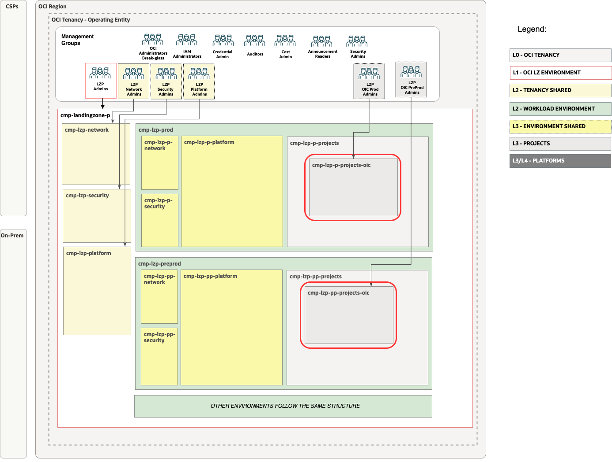

# OIC Landing Zone Extension Set-up <!-- omit from toc -->

## **Table of Contents** <!-- omit from toc -->

- [**1. Summary**](#1-summary)
- [**2. Setup IAM Configuration**](#2-setup-iam-configuration)
  - [**2.1. Compartments**](#21-compartments)
  - [**2.2 Groups**](#22-groups)
  - [**2.3 Policies**](#23-policies)
- [**3. Setup Network Configuration**](#3-setup-network-configuration)
  - [**3.1 VCNs**](#31-vcns)
  - [**3.2 Subnets**](#32-subnets)
  - [**3.3 Route Tables (RTs)**](#33-route-tables-rts)
  - [**3.4 Security Lists (SLs)**](#34-security-lists-sls)
  - [**3.5 Network Security Groups (NSGs)**](#35-network-security-groups-nsgs)
  - [**3.6 Gateways**](#36-gateways)
    - [**3.6.1 Dynamic Routing Gateway (DRGs) Attachments**](#361-dynamic-routing-gateway-drgs-attachments)
    - [**3.6.2 Service Gateway**](#362-service-gateway)
- [**4. JSON files Required Changes**](#4-json-files-required-changes)
- [**5. Deploy**](#5-deploy)

## **1. Summary**

|                         |                                                                                                                            |
| ----------------------- | -------------------------------------------------------------------------------------------------------------------------- |
| **NAME**                | OIC Landing Zone Extension set-up                                                                                                    |
| **OBJECTIVE**           | Provision Identity and Network                                                                               |
| **TARGET RESOURCES**    | - **Identity**: Compartments, Groups, Dynamic groups and Policies  - **Network**: Spoke VCNs, Route tables, Security Lists, NSGs                 |
| **PREREQUISITES**       | The [One-OE](../../../blueprints/one-oe/) Blueprint deployed as a foundation.   For this example we have used:   [](https://cloud.oracle.com/resourcemanager/stacks/create?zipUrl=https://github.com/oci-landing-zones/terraform-oci-modules-orchestrator/archive/refs/tags/v2.0.7.zip&zipUrlVariables={"input_config_files_urls":"https://raw.githubusercontent.com/oci-landing-zones/oci-landing-zone-operating-entities/master/blueprints/one-oe/runtime/one-stack/oci_open_lz_one-oe_iam.auto.tfvars.json,https://raw.githubusercontent.com/oci-landing-zones/oci-landing-zone-operating-entities/master/addons/oci-hub-models/hub_a/oci_open_lz_hub_a_iam.auto.tfvars.jso,https://raw.githubusercontent.com/oci-landing-zones/oci-landing-zone-operating-entities/master/blueprints/one-oe/runtime/one-stack/oci_open_lz_one-oe_observability_cisl1.auto.tfvars.json,https://raw.githubusercontent.com/oci-landing-zones/oci-landing-zone-operating-entities/master/blueprints/one-oe/runtime/one-stack/oci_open_lz_one-oe_security_cisl1.auto.tfvars.json"})  **Note**: To understand how to perform this operation with ORM, follow these [steps](ORM_ONE-OE_deployment_steps.md).|
| **CONFIGURATION FILES** | - [oci_oic_lz_ext_iam.auto.tfvars.json](./oci_oic_lz_ext_iam.auto.tfvars.json)    - [oci_oic_lz_ext_network.auto.tfvars.json](./oci_oic_lz_ext_network.auto.tfvars.json)|
| **DEPLOYMENT**          | [](https://cloud.oracle.com/resourcemanager/stacks/create?zipUrl=https://github.com/oci-landing-zones/terraform-oci-modules-orchestrator/archive/refs/tags/v2.0.5.zip&zipUrlVariables={"input_config_files_urls":"https://raw.githubusercontent.com/oci-landing-zones/oci-landing-zone-operating-entities/master/workload-extensions/oic/oic/oci_oic_lz_ext_iam.auto.tfvars.json,https://raw.githubusercontent.com/oci-landing-zones/oci-landing-zone-operating-entities/master/workload-extensions/OIC/1_oic_extension/oci_oic_lz_ext_network.auto.tfvars.json"})   **Note**: To understand how to perform this operation with ORM, follow these [steps](ORM_OIC-LZ-EXT_deployment_steps.md). [Terraform CLI](/commons/content/terraform.md)  can be also used.           |

&nbsp; 

## **2. Setup IAM Configuration**

For configuring and running the One-OE Landing Zone OIC extension IAM Layer use the following JSON file: [oci_oic_lz_ext_iam.auto.tfvars.json](./oci_oic_lz_ext_iam.auto.tfvars.json). You can customize this configuration to fit your exact OCI IAM topology.

This configuration file covers three categories of resources described in the next sections.

###  **2.1. Compartments**

The OIC LZ extension provisions two **compartments** dedicated to managing environments, such as PROD and PRE-PROD.

New OIC compartments will be added as project in the One-OE LZ environments, following the example shown in the next diagram:

> [!NOTE]
> For extended documentation regarding compartment definition please refer to the [Identity & Access Management CIS Terraform module compartment example](https://github.com/oci-landing-zones/terraform-oci-modules-iam/blob/main/compartments/examples/vision/input.auto.tfvars.template).

### **2.2 Groups**

The OIC extension will deploy IAM groups to manage resources in OIC compartments and provide fine-grained access to specific OIC resources.

As part of the deployment the following groups are created in the [Default Identity Domain](https://docs.oracle.com/en-us/iaas/Content/Identity/domains/overview.htm):

| ID     |     NAME                       | TYPE | OBJECTIVES                                  |
| ------ |  -------------------------- | ------------------------------------------- |---|
| GRP.00 |  grp-lzp-p-projects-oic-admins | IAM | Group for managing OIC Prod related resources |
| GRP.01 |  grp-lzp-p-projects-oic-users | IAM | Group for operating OIC Prod related resources |
| GRP.02 |  grp-lzp-pp-projects-oic-admins | IAM | Group for managing OIC PreProd related resources |
| GRP.03 |  grp-lzp-pp-projects-oic-users | IAM | Group for operating OIC PreProd related resources |

> [!NOTE]
> For extended documentation regarding group definition please refer to the [Identity & Access Management CIS Terraform module groups example](https://github.com/oci-landing-zones/terraform-oci-cis-landing-zone-iam/blob/main/groups/examples/vision/input.auto.tfvars.template).

### **2.3 Policies**

As part of the deployment the following policies are created:
| Policy                     | Description                                             | Manage resources             | Use resources                   | Inspect resources |
| -------------------------- | ------------------------------------------------------- | ---------------------------- | ------------------------------- | ----------------- |
| pcy-lzp-p-projects-oic-admins | Grants group **grp-lzp-p-projects-oic-admins** permissions. | OIC (Create, Delete, Move) |     |     |
| pcy-lzp-p-projects-oic-users | Grants group **grp-lzp-p-projects-oic-users** permissions. | OIC (Update) | OIC (Start, Stop) |     |
| pcy-lzp-pp-projects-oic-admins | Grants group **grp-lzp-pp-projects-oic-admins** permissions. | OIC (Create, Delete, Move) |     |     |IPs |    |
| pcy-lzp-pp-projects-oic-users | Grants group **grp-lzp-pp-projects-oic-users** network permissions. | OIC (Update) | OIC (Start, Stop) |     |

> [!NOTE]
>For extended documentation regarding policies refer to the [Identity & Access Management CIS Terraform module policies examples](https://github.com/oci-landing-zones/terraform-oci-cis-landing-zone-iam/tree/main/policies/examples) and [policy resource documentation](https://github.com/oci-landing-zones/terraform-oci-cis-landing-zone-iam/tree/main/policies)

## **3. Setup Network Configuration**

OIC does not require any network configuration in order to deploy.
The network configuration below is to allow for the deployment of the optional supporting services for the OIC Connectivity Agent and Database

For configuring and running the OIC LZ extension Network layer use the following JSON file: [oci_oic_lz_ext_network.auto.tfvars.json](./oci_oic_lz_ext_network.auto.tfvars.json).

Our OIC LZ extension will deploy the necessary core resources for both the Production and Pre-production OIC Connectivity Agent and Database environments included in the ONE-OE blueprint.

The network layer covers the following resources:
1. Hub VCN for traffic inspection purposes, centralized DNS service, Internet Gateway, and NAT Gateway.
2. Spoke management VCN for OIC Cloud Manager purposes.
3. Spoke VNCs for each environment - one Spoke Pre-prod OIC VCN and one Spoke Prod OIC VCN
4. Subnets - OIC required subnets; like LBs, Apps, FSS, DBs. Including internal and external OIC modules.
5. Service Gateway - Service Gateway for access OCI services in all VCNs
6. Security List - allowing all ingress/egress
7. NSGs.
8. Route Tables.
9. DRG Attachments - Connect spokes with the central Hub

In this asset, we use reserved CIDR blocks for the different VCNs, but this can be customized. To learn more about managing your OCI subnetting, we recommend checking this [asset](https://github.com/oci-landing-zones/oci-landing-zone-operating-entities/tree/LZ_Subnetting/addons/oci-lz-subnetting).

For customization of the pre-defined setup please refer to the [Networking documentation](https://github.com/oci-landing-zones/terraform-oci-cis-landing-zone-networking) for documentation and examples.

### **3.1 VCNs**

The following table describes the deployed VCNs.

| ID       | NAME           | OBJECTIVES                         |
| ------  | -------------- | ---------------------------------- |
| VCN.01  | vcn-fra-lzp-m-oic | Spoke VCN dedicated to OICCM set-up |
| VCN.02  | vcn-fra-lzp-p-oic | Spoke VCN dedicated to Prod OIC set-up |
| VCN.03  | vcn-fra-lzp-pp-oic | Spoke VCN dedicated to Preprod OIC set-up |

### **3.2 Subnets**

The following table describes the deployed Subnets added for each environment OIC platform:

| ID    |  NAME             | OBJECTIVES                |
| ----- | ---------------- | ------------------------- |
| SN.01 |  sn-fra-lzp-m-oic-lb | OICCM lb subnet |
| SN.02 |  sn-fra-lzp-m-oic-app | OICCM app subnet |
| SN.03 |  sn-fra-lzp-p-oic-lb-ext | OIC Prod external lb subnet |
| SN.04 |  sn-fra-lzp-p-oic-lb-int | OIC Prod internal lb subnet |
| SN.05 |  sn-fra-lzp-p-oic-app-ext | OIC Prod external app subnet |
| SN.06 |  sn-fra-lzp-p-oic-app-int | OIC Prod internal app subnet |
| SN.07 |  sn-fra-lzp-p-oic-fss | OIC Prod fss subnet |
| SN.08 |  sn-fra-lzp-p-oic-db | OIC Prod db subnet |
| SN.09 |  sn-fra-lzp-p-oic-db-bck | OIC Prod db exadata backup subnet |
| SN.10 |  sn-fra-lzp-pp-oic-lb-ext | OIC PreProd external lb subnet |
| SN.11 |  sn-fra-lzp-pp-oic-lb-int | OIC PreProd internal lb subnet |
| SN.12 |  sn-fra-lzp-pp-oic-app-ext | OIC PreProd external app subnet |
| SN.13 |  sn-fra-lzp-pp-oic-app-int | OIC PreProd internal app subnet |
| SN.14 |  sn-fra-lzp-pp-oic-fss | OIC PreProd fss subnet |
| SN.15 |  sn-fra-lzp-pp-oic-db | OIC PreProd db subnet |
| SN.16 |  sn-fra-lzp-pp-oic-db-bck | OIC PreProd db exadata backup subnet |

### **3.3 Route Tables (RTs)**

The following table describes the deployed Route Tables:

| ID    |  NAME               | OBJECTIVES                            |
| ----- |  ------------------ | ------------------------------------- |
| RT.01 |  rt-fra-lzp-m-oic-lb | OICCM lb subnet route table |
| RT.02 |  rt-fra-lzp-m-oic-app | OICCM app subnet route table |
| RT.03 |  rt-fra-lzp-p-oic-lb-ext | OIC Prod external lb subnet route table |
| RT.04 |  rt-fra-lzp-p-oic-lb-int | OIC Prod internal lb subnet route table |
| RT.05 |  rt-fra-lzp-p-oic-app-ext | OIC Prod external app subnet route table |
| RT.06 |  rt-fra-lzp-p-oic-app-int | OIC Prod internal app subnet route table |
| RT.07 |  rt-fra-lzp-p-oic-fss | OIC Prod fss subnet route table |
| RT.08 |  rt-fra-lzp-p-oic-db | OIC Prod db subnet route table |
| RT.09 |  rt-fra-lzp-p-oic-db-bck | OIC Prod db exadata backup subnet route table |
| RT.10 |  rt-fra-lzp-pp-oic-lb-ext | OIC PreProd external lb subnet route table |
| RT.11 |  rt-fra-lzp-pp-oic-lb-int | OIC PreProd internal lb subnet route table |
| RT.12 |  rt-fra-lzp-pp-oic-app-ext | OIC PreProd external app subnet route table |
| RT.13 |  rt-fra-lzp-pp-oic-app-int | OIC PreProd internal app subnet route table |
| RT.14 |  rt-fra-lzp-pp-oic-fss | OIC PreProd fss subnet route table |
| RT.15 |  rt-fra-lzp-pp-oic-db | OIC PreProd db subnet route table |
| RT.16 |  rt-fra-lzp-pp-oic-db-bck | OIC PreProd db exadata backup subnet route table |

### **3.4 Security Lists (SLs)**
The following table describes the deployed Security Lists (SLs):

| ID    |  NAME                | OBJECTIVES                              |
| ----- |  ------------------- | --------------------------------------- |
| SL.01 |  sl-fra-lzp-m-oic-lb | OICCM lb subnet security list |
| SL.02 |  sl-fra-lzp-m-oic-app | OICCM app subnet security list |
| SL.03 |  sl-fra-lzp-p-oic-lb-ext | OIC Prod external lb subnet security list |
| SL.04 |  sl-fra-lzp-p-oic-lb-int | OIC Prod internal lb subnet security list |
| SL.05 |  sl-fra-lzp-p-oic-app-ext | OIC Prod external app subnet security list |
| SL.06 |  sl-fra-lzp-p-oic-app-int | OIC Prod internal app subnet security list |
| SL.07 |  sl-fra-lzp-p-oic-fss | OIC Prod fss subnet security list |
| SL.08 |  sl-fra-lzp-p-oic-db | OIC Prod db subnet security list |
| SL.09 |  sl-fra-lzp-p-oic-db-bck | OIC Prod db exadata backup subnet security list |
| SL.10 |  sl-fra-lzp-pp-oic-lb-ext | OIC PreProd external lb subnet security list |
| SL.11 |  sl-fra-lzp-pp-oic-lb-int | OIC PreProd internal lb subnet security list |
| SL.12 |  sl-fra-lzp-pp-oic-app-ext | OIC PreProd external app subnet security list |
| SL.13 |  sl-fra-lzp-pp-oic-app-int | OIC PreProd internal app subnet security list |
| SL.14 |  sl-fra-lzp-pp-oic-fss | OIC PreProd fss subnet security list |
| SL.15 |  sl-fra-lzp-pp-oic-db | OIC PreProd db subnet security list |
| SL.16 |  sl-fra-lzp-pp-oic-db-bck | OIC PreProd db exadata backup subnet security list|

### **3.5 Network Security Groups (NSGs)**
The following table describes the deployed Security Lists (SLs):

| ID    |  NAME                | OBJECTIVES                              |
| ----- |  ------------------- | --------------------------------------- |
| NSG.01 |  nsg-fra-lzp-m-oic-lb | OICCM lb subnet network security groups |
| NSG.02 |  nsg-fra-lzp-m-oic-app | OICCM app subnet network security groups |
| NSG.03 |  nsg-fra-lzp-p-oic-lb-ext | OIC Prod external lb subnet network security groups |
| NSG.04 |  nsg-fra-lzp-p-oic-lb-int | OIC Prod internal lb subnet network security groups |
| NSG.05 |  nsg-fra-lzp-p-oic-app-ext | OIC Prod external app subnet network security groups |
| NSG.06 |  nsg-fra-lzp-p-oic-app-int | OIC Prod internal app subnet network security groups |
| NSG.07 |  nsg-fra-lzp-p-oic-fss | OIC Prod fss subnet network security groups |
| NSG.08 |  nsg-fra-lzp-p-oic-db | OIC Prod db subnet network security groups |
| NSG.09 |  nsg-fra-lzp-p-oic-db-bck | OIC Prod db exadata backup subnet network security groups |
| NSG.10 |  nsg-fra-lzp-pp-oic-lb-ext | OIC PreProd external lb subnet network security groups |
| NSG.11 |  nsg-fra-lzp-pp-oic-lb-int | OIC PreProd internal lb subnet network security groups |
| NSG.12 |  nsg-fra-lzp-pp-oic-app-ext | OIC PreProd external app subnet network security groups |
| NSG.13 |  nsg-fra-lzp-pp-oic-app-int | OIC PreProd internal app subnet network security groups |
| NSG.14 |  nsg-fra-lzp-pp-oic-fss | OIC PreProd fss subnet network security groups |
| NSG.15 |  nsg-fra-lzp-pp-oic-db | OIC PreProd db subnet network security groups |
| NSG.16 |  nsg-fra-lzp-pp-oic-db-bck | OIC PreProd db exadata backup subnet network security groups|

### **3.6 Gateways**

#### **3.6.1 Dynamic Routing Gateway (DRGs) Attachments**

The following tables describe the deployed DRG Attachments.

| ID      |  NAME                      | OBJECTIVES                                   |
| ------- |  ------------------------- | -------------------------------------------- |
| DRGA.01 |  drgatt-vcn-fra-lzp-m-oic | DRG Attachment for the OICCM spoke to the hub 
| DRGA.02 |  drgatt-vcn-fra-lzp-p-oic | DRG Attachment for the OIC Prod spoke to the hub |
| DRGA.03 |  drgatt-vcn-fra-lzp-pp-oic | DRG Attachment for the OIC PreProd spoke to the hub 

#### **3.6.2 Service Gateway**

The following table describes the proposed Service Gateways added for each environment OIC platform:

| ID    |  NAME          | OBJECTIVES           |
| ----- |  ------------- | -------------------- |
| SGW.01 |  sgw-fra-lzp-m-oic | SGW OICCM VCN. |
| SGW.02 |  sgw-fra-lzp-p-oic | SGW OIC Prod VCN. |
| SGW.03 |  sgw-fra-lzp-pp-oic | SGW OIC PreProd VCN. |

## **4. JSON files Required Changes**

If ONE-OE is used as the foundation Landing Zone with output saving enabled, running this OIC extension with the added dependencies will automatically match the keys with the correct OCIDs. No changes to the JSON file are needed. Therefore, you can skip this section and move to section 5.

If you are using the CIS Landing Zone or another OCI Landing Zone option, this configuration file requires modification to reference the OCIDs of the existing deployed resources. Locate the values indicated below and replace them with the correct OCIDs.

| Resource         | Section          | Replace with OCIDs              | Description                        |
| ------------------------- | ------| --------------------------------- | ---------------------------------- |
| cmp-lzp-p-platform |  compartments| CMP-LZP-P-PLATFORM-KEY | The Prod platforms compartment OCID in Prod Env |
| cmp-lzp-d-platform | compartments| CMP-LZP-PP-PLATFORM-KEY| The Pre-prod platforms compartment OCID  in Preprod Env |
| cmp-lzp-platform |compartments | CMP-LZP-PLATFORM-KEY| The Shared platforms compartment OCID |
| Prod Network Compartment | Network| CMP-LZP-P-NETWORK-KEY | The OCID of the Prod Network Compartment |
| Pre-prod Network Compartment | Network| CMP-LZP-PP-NETWORK-KEY |  The OCID of the Pre-prod Network Compartment  |
| Mgt Network Compartment |  Network| CMP-LZP-NETWORK-KEY |  The OCID of the Network Compartment |
| Hub DRG                  | Network| DRG-FRA-LZP-HUB-KEY                 | The OCID of the DRG in Hub deployed by One-OE LZ             |
| Hub DRG Route Table      | Network| OCID-DRG-HUB-ROUTE-TABLE      | The OCID of Route table in DRG  |

**NOTE:**
Policies contain compartment paths. 
The paths can change based on the modification in the previous [Compartments](#21-compartments) section. The paths need to be updated following the OCI [Policies and Compartment hierarchy](https://docs.oracle.com/en-us/iaas/Content/Identity/Concepts/policies.htm#hierarchy).

## **5. Deploy**

Use the magic button provided in the summary section to deploy the OIC LZ extension using [Oracle Resource Manager (ORM)](/../../../commons/content/orm.md) or use [Terraform CLI](../../../commons/content/terraform.md).

This operation creates a default routing configuration. To complete the network layer setup, deploy the firewalls and update the routing in the hub to prepare for deploying OIC Cloud Manager and OIC environments. All these steps are defined in this [POST operation](1.1_Network_post_updates/readme.md). Once completed, everything will be ready for onboarding OIC Cloud Manager.

You can now proceed and install [OIC Cloud Manager](../2_oiccm/).

&nbsp;

# License <!-- omit from toc -->

Copyright (c) 2025 Oracle and/or its affiliates.

Licensed under the Universal Permissive License (UPL), Version 1.0.

See [LICENSE](/LICENSE) for more details.
